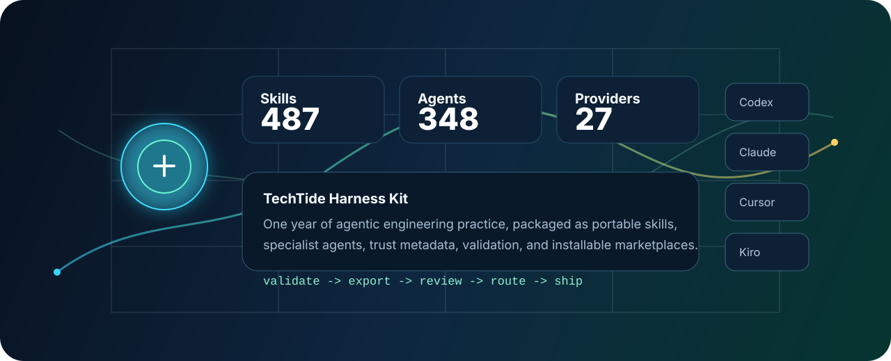
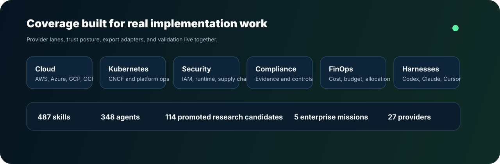
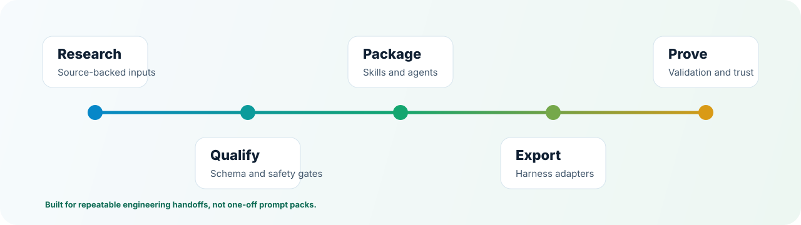

# TechTide Harness Kit

<div align="center">
  

  <h3>Production skills, specialist agents, trust metadata, and installable harness adapters.</h3>

  <p>
    <a href="https://www.npmjs.com/package/@techtide/harness-kit"></a>
    <a href="LICENSE"></a>
    <a href="https://github.com/TechTideOhio/techtide-harness-kit/actions/workflows/codeql.yml"></a>
    <a href="https://github.com/TechTideOhio/techtide-harness-kit/actions/workflows/install-paths-smoke.yml"></a>
    <a href="https://scorecard.dev/viewer/?uri=github.com/TechTideOhio/techtide-harness-kit"></a>
    <a href="https://docs.npmjs.com/generating-provenance-statements"></a>
  </p>

  <p>
    <a href="#try-in-10-minutes">Try in 10 minutes</a> |
    <a href="#what-this-is">What this is</a> |
    <a href="#catalog">Catalog</a> |
    <a href="#supported-harnesses">Harnesses</a> |
    <a href="#trust-and-validation">Trust</a> |
    <a href="#official-links">Official links</a>
  </p>

  
</div>

## What This Is

TechTide Harness Kit is the public showcase repo for one year of agentic
engineering work by Alex Cinovoj and the TechTide team. It packages the field
patterns, review gates, provider workflows, and harness adapters TechTide has
built while working across Columbus, Ohio, San Francisco, San Diego, and Miami.

The repo is designed for teams that need repeatable cloud, Kubernetes,
Terraform, security, compliance, FinOps, marketing governance, and delivery
workflows across modern coding harnesses.

Every public asset is meant to be inspected. Source notes, schema-backed
metadata, approval gates, permission posture, validation commands, and
integrity hashes live beside the work.

## Official Links

| Surface | Link |
| --- | --- |
| TechTide AI | [techtideai.io](https://techtideai.io/) |
| Alex Cinovoj | [linkedin.com/in/alexcinovoj](https://www.linkedin.com/in/alexcinovoj) |

## Catalog

| Asset | Count |
| --- | ---: |
| Skills | 487 |
| Agents | 348 |
| Promoted external research candidates | 114 |
| Enterprise missions | 5 |
| Provider lanes | 27 |

Current catalog: **487 skills**, **348 agents**, **114 promoted external
research candidates**, and **5 enterprise missions**.

Start with [CATALOG.md](CATALOG.md), [EVALS.md](EVALS.md), and
[TRUST.md](TRUST.md).



## Try In 10 Minutes

```bash
npm install
npm run validate
npx thk-export-agents --help
```

Export a focused pack:

```bash
npx thk-export-agents --platform claude-code --provider aws --repo .
npx thk-export-agents --platform codex --role cloud-security-engineer --repo .
npx thk-export-agents --platform gemini --all --repo .
```

The validation suite checks catalog shape, schemas, links, asset integrity,
marketplace manifests, provider routing, trust metadata, and install coverage.
It does not require secrets or customer data.

## What Ships

| Surface | Purpose |
| --- | --- |
| `skills/` | Portable task workflows with frontmatter, references, and guardrails. |
| `agents/` | Specialist roles with adapters for supported coding harnesses. |
| `rules/` | Harness-specific operating guidance. |
| `mcp/` | Trusted notes for official MCP server integrations. |
| `catalog/` | Machine-readable indexes, trust metadata, roles, and integrity hashes. |
| `powers/` | Kiro Power packages built from the provider catalog. |
| `plugins/` | Codex plugin packages and templates. |

Provider coverage includes AWS, Azure, OCI, GCP, Alibaba Cloud, Huawei Cloud,
Kubernetes, Terraform, CNCF tools, NVIDIA, European cloud providers, marketing
governance, FinOps, and coding harness lanes.



## Supported Harnesses

| Harness | Primary path | Notes |
| --- | --- | --- |
| Claude Code | `/plugin marketplace add TechTideOhio/techtide-harness-kit` | Plugin marketplace plus `thk-export-agents` for repo-local adapters. |
| OpenAI Codex | `codex plugin marketplace add TechTideOhio/techtide-harness-kit` | Marketplace lives at `.agents/plugins/marketplace.json`. |
| GitHub Copilot | `copilot plugin marketplace add TechTideOhio/techtide-harness-kit` | Marketplace lives at `.github/plugin/marketplace.json`. |
| Cursor | Clone repo and add it as a plugin directory | Manifest lives at `.cursor-plugin/plugin.json`; rules stay rules-first. |
| Gemini CLI / Antigravity | `npx thk-export-agents --platform gemini --all --repo .` | Exports workspace skills and agent adapters. |
| Kiro | Add selected `powers/techtide-*` directories | Kiro Powers plus optional exported agent adapters. |
| Lovable | `npm run lovable:write` | Builds one ZIP per Lovable-compatible skill for workspace import. |

For full install instructions, see
[docs/integrations/installation-guide.md](docs/integrations/installation-guide.md).

## Trust And Validation

The repo is built for reviewable, source-grounded work:

- Risky operations are read-first, approval-gated, and target-confirmed.
- Skills carry tool scopes, data classes, network posture, approval gates, and
  audit metadata in [catalog/skill-trust.json](catalog/skill-trust.json).
- External skills are quarantine-first and promoted only when source, license,
  provider mapping, privacy, and duplication checks pass.
- Compliance mappings are engineering aids, not legal or audit attestations.

| Need | File |
| --- | --- |
| Catalog overview | [CATALOG.md](CATALOG.md) |
| Validation summary | [EVALS.md](EVALS.md) |
| Trust posture | [TRUST.md](TRUST.md) |
| Data handling | [DATA-HANDLING.md](DATA-HANDLING.md) |
| Prompt-injection defenses | [PROMPT-INJECTION.md](PROMPT-INJECTION.md) |
| Control mapping | [CONTROL-MAPPING.md](CONTROL-MAPPING.md) |
| Security reporting | [SECURITY.md](SECURITY.md) |

## Common Commands

```bash
npm run validate
npm run proof-layer:check
npm run external-skills:check
npm run trust:check
npm run agents:export -- --list
npm run agents:export -- --list-providers
npm run agents:export -- --platform claude-code --all --repo .
```

Regenerate derived artifacts after intentional catalog changes:

```bash
npm run proof-layer:write
npm run plugin-manifest:write
npm run cursor-plugin:write
npm run kiro-powers:write
npm run manifest:write
npm run asset-integrity:write
```

## Docs

| Topic | Link |
| --- | --- |
| Installation | [docs/integrations/installation-guide.md](docs/integrations/installation-guide.md) |
| Harness compatibility | [docs/compatibility.md](docs/compatibility.md) |
| Cross-harness skills | [docs/cross-harness-skills.md](docs/cross-harness-skills.md) |
| Marketplace model | [docs/marketplace-model.md](docs/marketplace-model.md) |
| Lovable skill imports | [docs/integrations/lovable-skills.md](docs/integrations/lovable-skills.md) |
| Quality bar | [docs/quality-bar.md](docs/quality-bar.md) |
| Taxonomy | [docs/taxonomy.md](docs/taxonomy.md) |
| External skill research | [docs/external-skill-research.md](docs/external-skill-research.md) |

## Contributing

Contributions should be evidence-backed, source-grounded, and safe by default.
Start with [CONTRIBUTING.md](CONTRIBUTING.md), then run `npm run validate`
before opening a PR.

Report vulnerabilities through [SECURITY.md](SECURITY.md). Do not open public
issues containing exploit details, real credentials, customer data, or internal
system identifiers.
